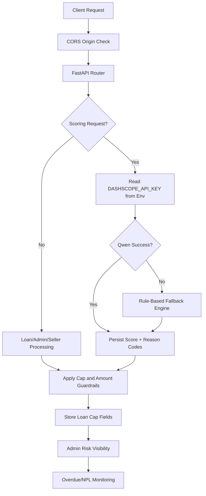

# SF12 - MicroBiz Loan: AI-Powered Micro Lending for Digital Economy Sellers

SF12 is an AI-native micro lending platform for Vietnam digital economy sellers (Shopee, Lazada, TikTok Shop, MoMo, ZaloPay) who are usually invisible to traditional credit systems.

Shinhan Finance can use SF12 to underwrite and monitor this segment with explainable AI scoring and revenue-based repayment, targeting portfolio NPL under 5%.

## Inspiration

Online sellers, freelancers, and gig workers often do not have CIC history, payslips, or formal tax records. Traditional underwriting rejects them even when real cashflow is healthy.

SF12 answers one question: what if AI can read merchant cashflow patterns like a CFO and convert them into reliable credit actions?

## What SF12 Does

SF12 works as a mini CFO for sellers:

- AI Alternative Credit Scoring
  - No CIC required.
  - Qwen AI analyzes 6-month cashflow and wallet behavior.
  - Returns score range 300-850 with explainable reason codes.
- Revenue-Based Repayment
  - Repayment is a percentage of actual revenue instead of fixed installments.
  - Lower deduction on slow days, higher deduction on peak-sale days.
- Smart Insights
  - Predictive alerts for stockout risk and demand surge.
  - Suggests timely disbursement to capture growth windows.
- Credit Gamification
  - Transparent level-up path to unlock higher limits and lower rates.
- Admin Risk Dashboard
  - Portfolio NPL, score distribution, segment risk, anomaly monitoring.

## Core Workflows


### 1) Seller Onboarding + Data Ingestion

1. Seller profile is created with KYC and consent flags.
2. Platform-level cashflow history is loaded (mock seed for demo, live APIs in roadmap).
3. System computes baseline seller indicators (revenue, return rate, activity, anomalies).

### 2) AI Scoring and Decisioning

1. Frontend calls `POST /api/loans/score/{seller_id}`.
2. Backend sends structured prompt to Qwen (`qwen-plus`) for score + factors.
3. If AI provider fails or output is invalid, engine falls back to deterministic rule-based scoring.
4. Seller record is updated with score, risk segment, and recommended limit.

### 3) Loan Application and Approval Envelope

1. Seller submits loan request via `POST /api/loans/apply`.
2. Engine enforces amount band and cap logic:
   - Min amount floor
   - Max seller cap
   - Absolute cap
3. Interest and repayment percent are assigned from score-based policy.
4. Loan is stored with payable cap fields (`cap_rate_annual`, `cap_total_payable`) and reason codes.

### 4) Revenue-Based Repayment Simulation

1. Frontend calls `GET /api/loans/repayment-simulator`.
2. System projects monthly payment and estimated payoff duration from revenue share.
3. UI compares fixed payment vs dynamic revenue share to show stress reduction and payoff behavior.

### 5) Portfolio Risk Monitoring (Admin)

1. Admin dashboard reads:
   - `GET /api/admin/dashboard`
   - `GET /api/admin/portfolio`
   - `GET /api/admin/risk-analytics`
2. Team monitors NPL trend, overdue bucket, score bands, and segment concentration.
3. Risk policy can be tuned by adjusting score thresholds, limits, and repayment percentages.

## Architecture and Tech Stack

| Layer | Technology |
|---|---|
| AI Engine | Qwen Plus via DashScope compatible API |
| Backend | FastAPI + SQLAlchemy + SQLite |
| Credit Engine | AI-first scoring + rule-based fallback (6 weighted factors) |
| Frontend | React 19 + Vite + Tailwind CSS + Recharts |
| Data | Mock generator (50 sellers, 8 months, 500+ cashflow rows) |

### Scoring Factors (Fallback Engine)

- Revenue consistency: 25%
- Transaction volume trend: 20%
- Return/refund risk: 15%
- Platform diversity: 15%
- Growth trajectory: 15%
- Account activity: 10%

## Product Screens

- `/` - Landing and value proposition
- `/seller` - Seller dashboard and profile analytics
- `/scoring` - AI scoring demo with step-by-step analysis animation
- `/mobile` - Mobile seller experience
- `/admin` - Portfolio and risk dashboard

## API Summary

### Sellers

- `GET /api/sellers`
- `GET /api/sellers/{seller_id}`
- `GET /api/sellers/{seller_id}/cashflow`

### Loans

- `POST /api/loans/score/{seller_id}`
- `POST /api/loans/apply`
- `GET /api/loans/repayment-simulator`
- `GET /api/loans`
- `GET /api/loans/{loan_id}`

### Admin

- `GET /api/admin/dashboard`
- `GET /api/admin/portfolio`
- `GET /api/admin/risk-analytics`

### Legacy EWA Endpoints (demo compatibility)

- `POST /api/ewa/apply`
- `POST /api/ewa/biometric-verify`
- `POST /api/ewa/disburse`
- `GET /api/ewa/employee/{employee_id}`
- `GET /api/ewa/history/{employee_id}`
- `GET /api/ewa/limits/check`

## Deployment

### Local Development

### Prerequisites

- Python 3.11+
- Node.js 18+
- npm 9+

### 1) Backend

```bash
cd backend
python -m pip install -r requirements.txt
fastapi dev app/main.py
```

Backend runs at `http://localhost:8000`.

### 2) Frontend

```bash
cd frontend
npm install
npm run dev
```

Frontend runs at `http://localhost:5173`.

### 3) Optional Seed Reset

```bash
cd backend
python seed_data/generate_mock_data.py --customers 50 --months 8 --seed 42
```

### Environment Variables

Use `.env.example` as base and set real values in `.env`.

| Variable | Purpose |
|---|---|
| `DASHSCOPE_API_KEY` | Qwen API key for AI scoring |
| `CORS_ORIGINS` | Comma-separated frontend origins |
| `DEMO_REBUILD_SCHEMA_ON_STARTUP` | Recreate schema on startup (`true/false`) |
| `DEMO_RESET_ON_STARTUP` | Reload seed data on startup (`true/false`) |
| `VITE_API_URL` | Frontend API base URL in deployment |

### Vercel Deployment (Frontend)

Project includes `vercel.json` with:

- Build command: `cd frontend && npm run build`
- Output directory: `frontend/dist`
- Install command: `cd frontend && npm install`
- Region: `hkg1`
- Security headers:
  - `X-Content-Type-Options: nosniff`
  - `X-Frame-Options: DENY`
  - `X-XSS-Protection: 1; mode=block`

Deploy:

```bash
vercel --prod
```

### GitHub Actions Workflow

File: `.github/workflows/deploy.yml`

Trigger:

- Push to `main`
- PR targeting `main`

Pipeline:

1. Checkout code
2. Setup Node.js 18
3. Install frontend deps (`npm ci`)
4. Build frontend (`npm run build`)
5. Deploy via `amondnet/vercel-action`

Required GitHub Secrets:

- `VERCEL_TOKEN`
- `ORG_ID`
- `PROJECT_ID`

## Security and Compliance

### Security Flow Diagram (Mermaid)



### Current Security Controls (Implemented)

- CORS allowlist via `CORS_ORIGINS`
- Secret isolation via environment variables (no API key hardcoding)
- Explainable AI outputs with reason codes for auditability
- AI failure fallback to deterministic rule engine for service reliability
- Payable cap fields on loan contracts:
  - `cap_rate_annual`
  - `cap_total_payable`
- Basic browser hardening headers on Vercel

### Risk Controls in Product Logic

- Conservative amount caps (seller cap + system max cap)
- Score-tiered pricing and repayment percentage
- Segment-based risk classification (`low`, `medium`, `high`, `watchlist`)
- Portfolio visibility for overdue, NPL proxy, and score distribution

### Security and Compliance Roadmap

Phase 1 (Production Pipeline):

- Live API integration (Shopee, TikTok Shop, MoMo)
- eKYC + eContract
- Virtual account auto-disbursement and auto-collection with idempotency
- Middle-office sub-ledger and EOD posting

Phase 2 (Advanced AI Risk):

- GNN fraud detection for brushing networks
- Platform evasion anomaly checks
- Loan stacking detection via statement NLP

Phase 3 (Mobile Assistant):

- Cashflow thermometer and dynamic deduction transparency
- Predictive business alerts
- Voice advisory within legal contact hours

Phase 4 (Compliance and Scale):

- Interest cap enforcement targeting 20% yearly total-cost ceiling
- Decree 13/2023 data governance (consent, minimization, PII filtering)
- 30-day reconciliation-safe NPL classification
- 500-seller pilot with Shinhan

## Challenges Solved

- Structured JSON reliability from LLM output
  - Solved with explicit response-format constraints + fallback engine.
- Score calibration across 300-850 band
  - Solved with weighted-factor tuning against seeded risk patterns.
- Dynamic repayment projection
  - Solved via month-by-month simulation logic.
- Demo realism
  - Solved with multi-stage mock generator and fixed seed support.

## What We Learned

- AI scoring is useful only with strict guardrails and deterministic fallback.
- Revenue-based repayment aligns borrower and lender incentives.
- Explainability is mandatory in lending, not optional.
- Data quality is the strongest determinant of scoring quality.

## Project Structure

```text
sf12-microbiz-loan/
|-- backend/
|   |-- app/
|   |   |-- main.py
|   |   |-- database.py
|   |   |-- models/
|   |   |-- schemas/
|   |   |-- routers/
|   |   |   |-- sellers.py
|   |   |   |-- loans.py
|   |   |   |-- admin.py
|   |   |   `-- ewa.py
|   |   `-- services/
|   |       |-- qwen.py
|   |       `-- credit_score.py
|   |-- seed_data/
|   `-- requirements.txt
|-- frontend/
|   |-- src/
|   |   |-- pages/
|   |   |-- components/
|   |   `-- lib/
|   `-- package.json
|-- docs/
|-- vercel.json
`-- README.md
```

## Next Milestones

- Replace demo data ingestion with live platform connectors
- Add disbursement/collection orchestration with idempotent transaction ledger
- Harden compliance evidence and audit logs for production regulator review
- Launch controlled pilot and monitor real-world default behavior

